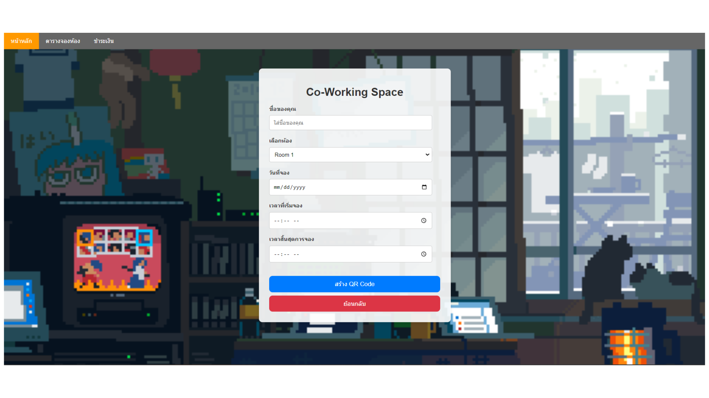
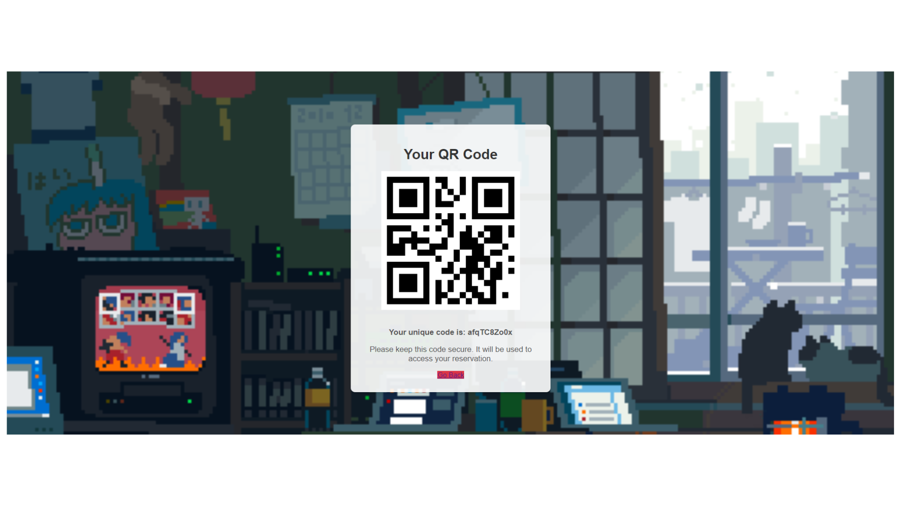
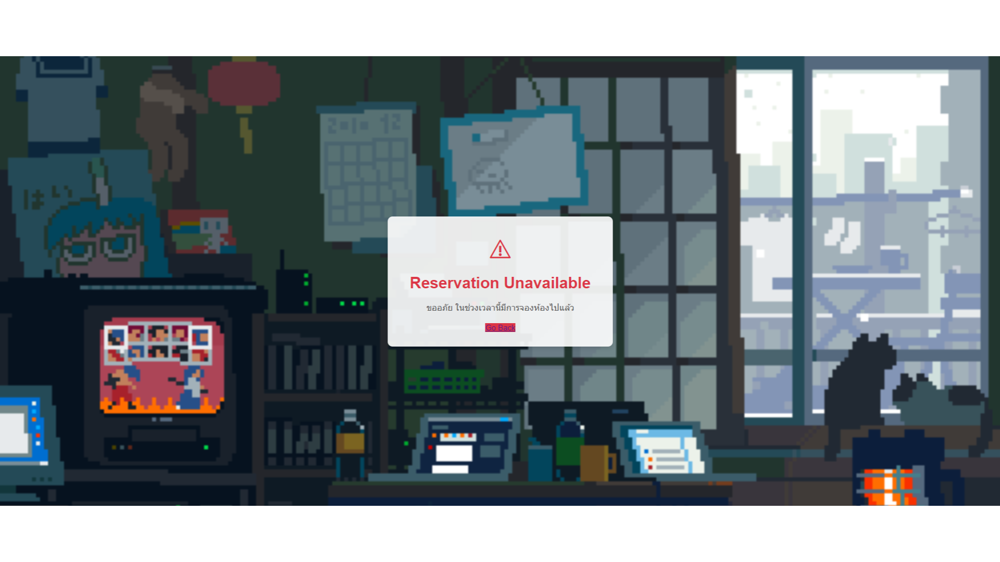
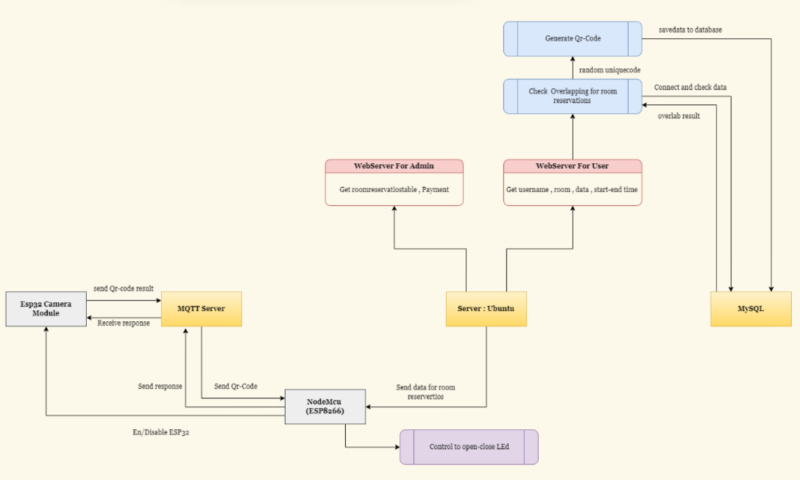

# QR Code-Based Working Space Reservation System



---

## 📌 Introduction
This project is a **smart reservation system** for co-working spaces using **QR Code technology**.  
It combines **web technologies (PHP, SQL)** with **IoT devices (ESP32-CAM, NodeMCU)** to provide an efficient and user-friendly solution for booking and accessing working spaces.

---

## 🛠️ System Principle

The main principles of the system are:
1. **Room Reservation via Website**  
   - Users select room, date, and time via a PHP + SQL web application.  
   - The system generates a unique QR code for each reservation.

2. **QR Code Validation**  
   - ESP32-CAM scans the QR code at the room entrance.  
   - The scanned data is compared with the current booking records.

3. **Access Control**  
   - If the reservation is valid, NodeMCU (ESP8266) controls electrical systems in the room.  
   - Prevents overlapping/double bookings automatically.

---

## 🔑 Key Features
- Online booking with QR code generation.  
- Real-time validation of QR codes.  
- Prevents double bookings.  
- IoT integration with ESP32-CAM & ESP8266.  
- Smart access control for working spaces.

---

## 📸 Project Images




---

## ⚙️ System Architecture


- **Server (Ubuntu)**: Hosts the reservation system (PHP + SQL).  
- **ESP32-CAM**: Scans QR codes and communicates with the server.  
- **ESP8266 (NodeMCU)**: Controls room power systems via MQTT.  
- **Adafruit MQTT**: Used for device-server communication.  

---

## 🚀 How to Use
1. Clone the repository:  
   ```bash
   git clone https://github.com/<your-username>/<repo-name>.git
